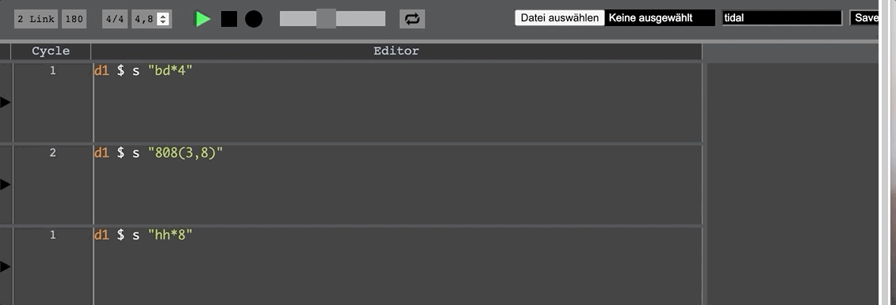

# cycseq - cycle sequencer for tidal 

See install-osx.md, install-win.md or install-linux.md for installation instructions.  See this document for usage.

This software represents a sequencer (similar to a step sequencer) for [TidalCycles](http://pages.tidalcycles.org/getting_started.html). With this sequencer it is possible to activate written code automatically.



Once everything is installed and TidalCycles is running, the client, server and an ableton link connenction must be started for the application.
To start everything at once you can simply run the following command:

```
cd ~/cycseq
node start
```

For TidalCycles to run synchronously, it is necessary to start the [carabiner](https://github.com/Deep-Symmetry/carabiner) software before.
This is necessary for the link synchronization to work (see for further information: https://tidalcycles.org/index.php/Link_synchronisation).

The connection to carabiner is established automatically when the application is started, if carabiner has been started before, because the connection has been stored in the startup script (see .ghciNoVisual).

To verify that everything is running, point your browser to your local IP address and port 8000.

```
http://127.0.0.1:8000
```

In the upper left corner there should then be displayed "1 Link" (the carabiner connection was established). 

If this is not the case (e.g. because the carabiner was started later), then TidalCycles can be connected to the carabiner manually:

```
sock <- carabiner tidal 4 (-0.14)
```

At this point you can test once if the written code can be evaluated. To do so, you can enter TidalCycles code in any of the large text fields and send it to SuperCollider by pressing Shift+Enter.

There are a number of keyboard shortcuts:
- Shift+Enter: evaluate code through the server (the textfield will repeat infinitely)
- Alt+Enter: If a textfield has a focus, the new element is created behind it. Otherwise, it is added to the end of the text fields
- Alt+Delete: Deletes a focused textfield

Since SuperCollider version 3.10.4 there is now Ableton Link Support. This can be used to change the clock of CycSeq and TidalCycles simultaneously.

To create a link connection with SuperCollider you can simply evaluate (with Shift+Enter in SuperCollider)
```l = LinkClock(1).latency_(Server.default.latency);``` 
And to set the tempo for everything you can use ```l.tempo = 90/60```

To make sure that the code is always triggered immediately and nothing is "swallowed", use [trigger 1](https://tidalcycles.org/index.php/trigger), i.e.

```
d1 $ trigger 1 $ s "bd(3,8)"
```

If there is no value in the "Cycle" field in a row, then the current evaluated code is repeated infinitely.
Each play button triggers the sequencer. The play button in the header starts the sequencer at the first text field. 
So it is possible to start the sequencer from any text field.

## Custom OSC messages

The sequencer sends custom osc messages, which are evaluated and could be forwarded via SuperCollider. 
For example, you can convert them to MIDI and then forward them to a DAW like Ableton to control start, stop and record. 
Each osc message has the type int and sends the value 1.

The messages are: 

- /ableton/play : is sent after the play (triangle) button is pressed
- /ableton/stop : is sent after the stop (square) button is pressed
- /ableton/record : is sent after the record (circle) button is pressed

In SuperCollider such a forwarding could look like the following:
```
MIDIClient.init;
~midiOut = MIDIOut(0); //Depends on your device, this should be a midi loop from your os

OSCFunc.newMatching({|msg, time, addr, recvPort| ~midiOut.control(0, ctlNum: 100, val: 65)}, '/ableton/play', n);
OSCFunc.newMatching({|msg, time, addr, recvPort| ~midiOut.control(0, ctlNum: 101, val: 65)}, '/ableton/stop',n);
OSCFunc.newMatching({|msg, time, addr, recvPort| ~midiOut.control(0, ctlNum: 102, val: 65)}, '/ableton/record',n);
```

## Notes

- This software is based on the extramuros project, but has a different primary goal. This software is not (currently) suitable for collaborative writing, but maybe it should be.
- This software is a kind of prototype without regard to testing, architecture or clean code.
- You can save and load your content. It will be saved in a custom json.file and automoatically download by pressing the save button. There seems to be a bug with missing newlines when a saved file is loaded
